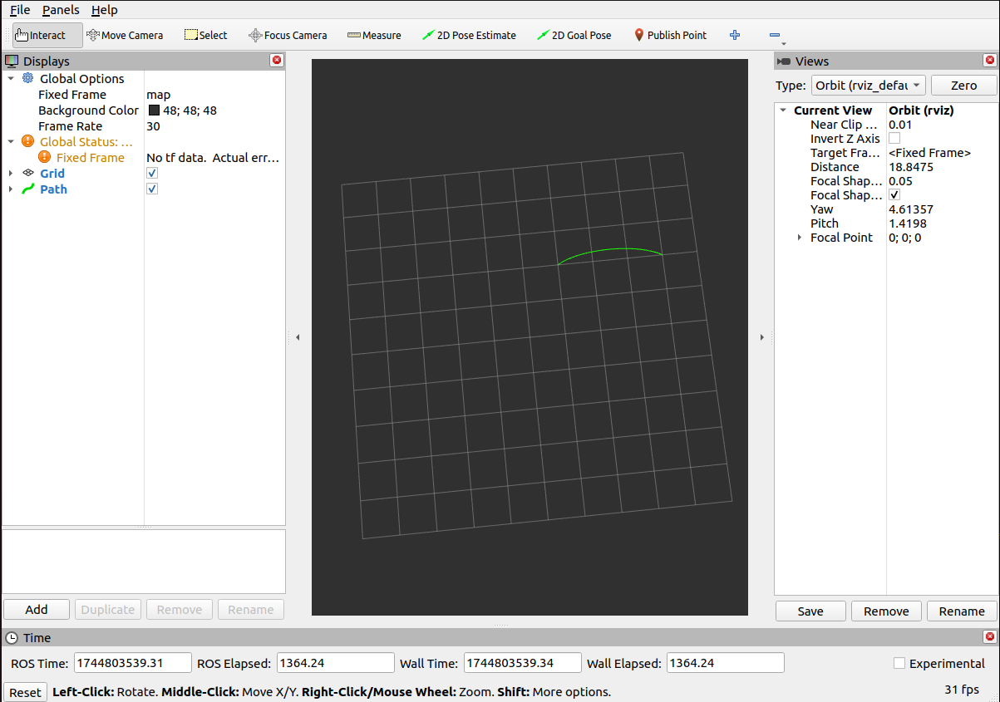

# Spline Creator

**Spline Creator** is a ROS 2 package that implements a Catmull–Rom spline publisher node. It computes a smooth, centripetal Catmull–Rom spline interpolation between four control points and publishes the resulting path as a `nav_msgs/Path` message.

# Development

## Clone the repo

```bash
git clone https://github.com/SuperGops7/CatmullRom-Spline.git
```

## Launching and visualization
```bash
cd spline_ws
colcon build
source install/setup.bash
ros2 launch spline_creator spline_launcher.py
```




## Future Work

1. Add a node that publishes the raw control points as red markers (spheres) for visualization in RViz.
2. Update the control points as parameters that can be passed.
